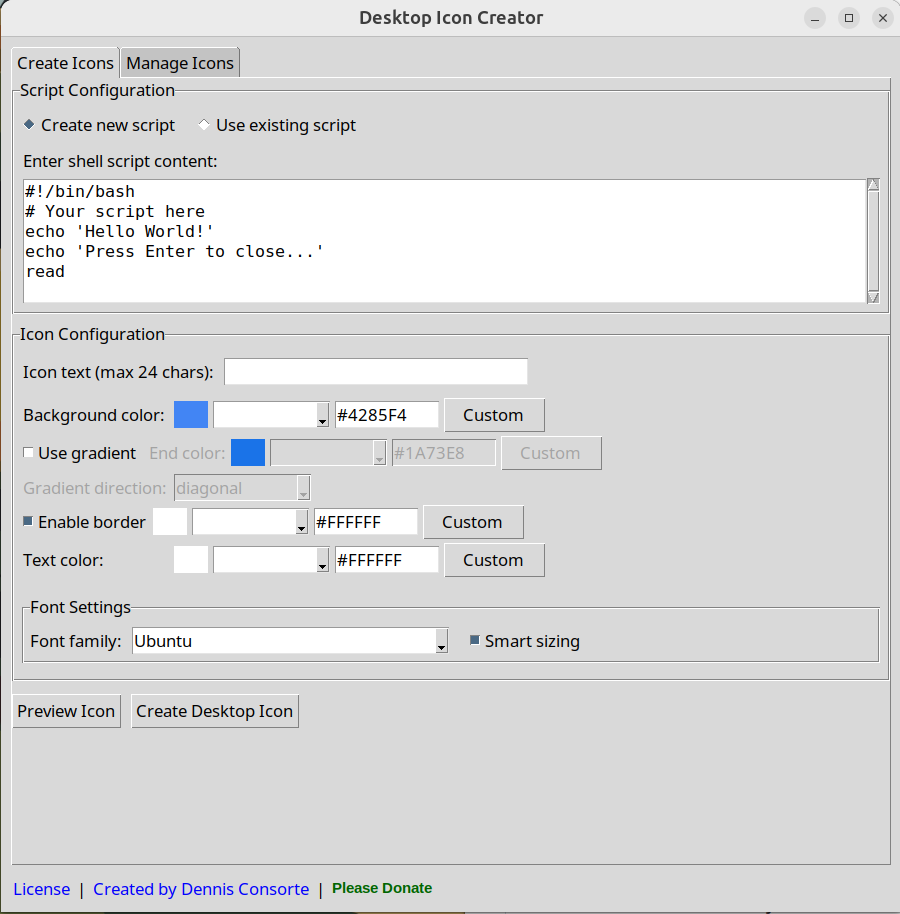
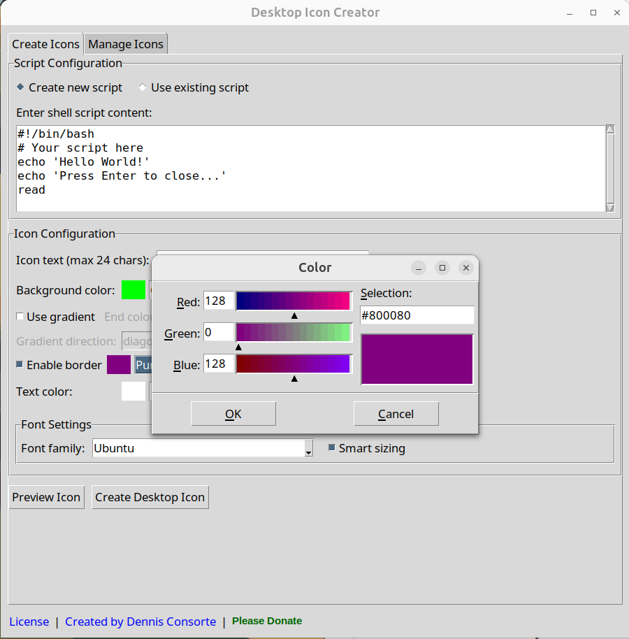
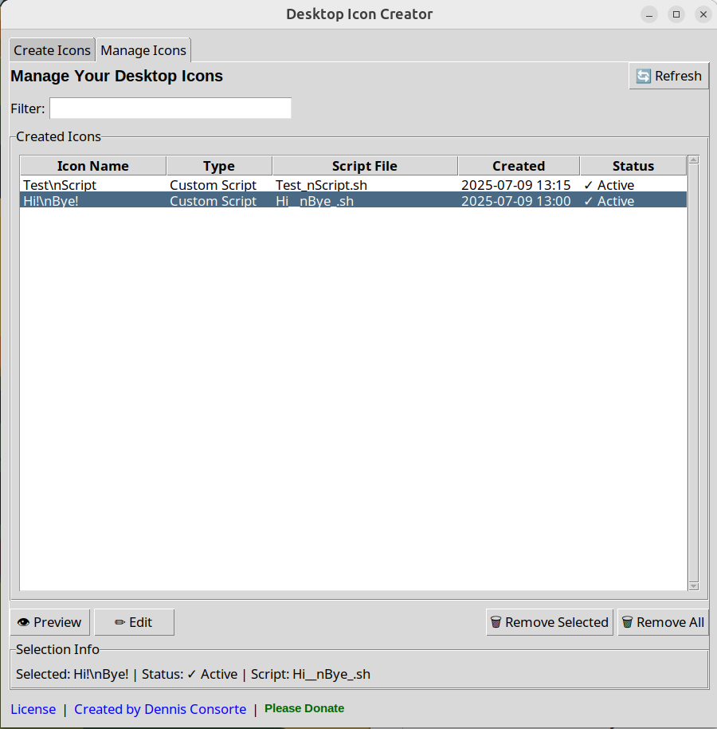
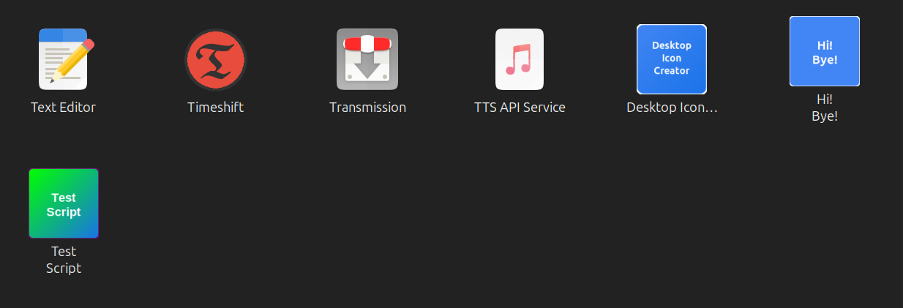
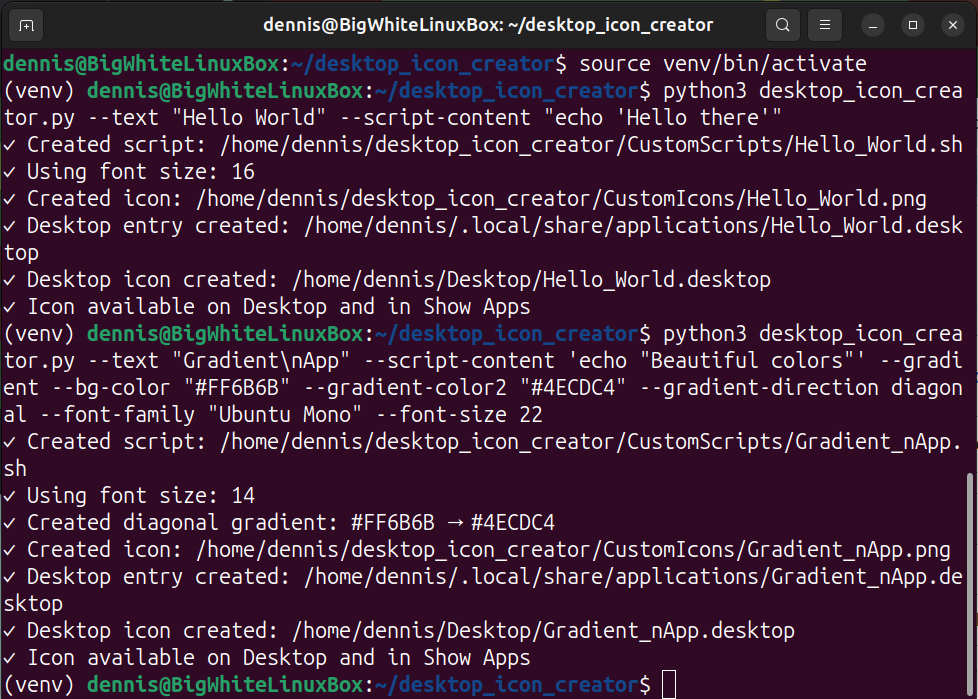
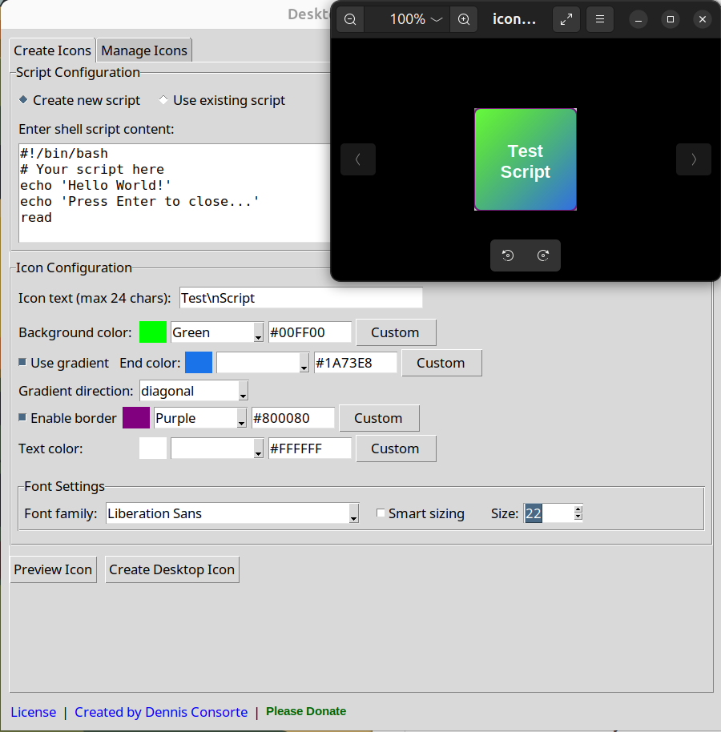

# Desktop Icon Creator for Ubuntu Linux

A powerful Python application for Ubuntu Desktop that creates beautiful, custom desktop icons for shell scripts. Design your icons with gradients, custom colors, fonts, and more - then deploy them instantly to both your desktop and the "Show Apps" launcher.

**Perfect for Ubuntu users who want to create custom desktop shortcuts, app launchers, and desktop icons without complex design software.**

  

**Keywords:** Ubuntu desktop icons, Linux custom launchers, Ubuntu app shortcuts, desktop icon generator, Linux GUI creator, Ubuntu desktop customization, shell script launcher, Ubuntu theming tools

## ✨ Features

### 🎨 **Visual Customization for Ubuntu Desktop**
- **Gradient Backgrounds** - Choose from diagonal, horizontal, vertical, or radial gradients for modern Ubuntu icons
- **Custom Colors** - RGB picker, hex codes, or color presets for background, text, and borders
- **Typography** - System font detection with smart sizing or manual control for Ubuntu fonts
- **Multi-line Text** - Use `\n` for line breaks in icon text - perfect for app names and descriptions
- **Live Preview** - See your custom Ubuntu desktop icon before creating it

### 🔧 **Shell Script Integration & Linux Automation**
- **Create New Scripts** - Write shell scripts directly in the app for Linux automation
- **Use Existing Scripts** - Browse and select existing `.sh` files and bash scripts
- **Automatic Execution** - Desktop icons launch scripts with proper Linux permissions

### 🚀 **Ubuntu Desktop Integration**
- **Desktop Shortcuts** - Icons appear on Ubuntu desktop and in "Show Apps" launcher
- **Automatic Permissions** - Scripts are made executable automatically on Ubuntu Linux
- **Trusted Launchers** - Desktop files are properly configured and trusted by Ubuntu GNOME

### 💻 **Multiple Interfaces for Linux Users**
- **Tabbed GUI Interface** - Intuitive tabbed interface with Create and Manage tabs
- **Icon Management** - View, edit, preview, and remove created icons with advanced filtering
- **Command Line** - Full CLI support for automation and scripting on Linux
- **Batch Processing** - Create multiple Ubuntu desktop icons via command line

### 🗂️ **Advanced Icon Management**
- **Visual Icon Browser** - See all created icons in an organized table view
- **Smart Search & Filter** - Find icons quickly by name, script, or type
- **Icon Status Monitoring** - See which icons are active, missing files, or have issues
- **Safe Removal Tools** - Remove individual icons or bulk cleanup with confirmations
- **Edit & Recreate** - Load existing icons for modification and improvement

## 📋 Prerequisites

- **Ubuntu 24.04.2 LTS** (or compatible Ubuntu Desktop with GNOME)
- **Python 3.12+**
- **Internet connection** (for initial setup)

## 🎯 Perfect For Ubuntu Users Who Need

- **Custom desktop shortcuts** for frequently used commands and scripts
- **Professional app launchers** for Python applications and development tools
- **Desktop icons for system administration** scripts and maintenance tools
- **Ubuntu desktop customization** and personalization
- **Quick access launchers** for web applications, databases, and services
- **Development environment shortcuts** (IDEs, servers, build scripts)
- **System monitoring tools** and diagnostic scripts
- **Backup and automation** script launchers
- **Educational tools** and learning environment shortcuts
- **Gaming and entertainment** application launchers

## 📸 Screenshots

### GUI Interface


### Color Picker



### Icon Management


### Created Icons


### Command Line Usage


### Preview Icon


## 🚀 Quick Start

### 1. **Download & Setup**
```bash
# Clone the repository
git clone https://github.com/dconsorte/desktop-icon-creator.git
cd desktop-icon-creator

# Run automated setup (installs everything)
chmod +x setup_environment.sh
./setup_environment.sh
```

### 2. **Launch the Application**
After setup completes, you can launch the app in multiple ways:

**🖱️ Click the Desktop Icon** (Easiest)
- Look for "Desktop Icon Creator" on your desktop
- Or find it in "Show Apps"

**💻 Command Line**
```bash
# Activate environment and launch GUI
source venv/bin/activate
python3 desktop_icon_creator.py

# Or use the convenience script
./activate_env.sh
```

## 📖 Usage Guide

### 🎨 **GUI Mode - Tabbed Interface**

The Desktop Icon Creator features a modern tabbed interface with two main sections:

#### **📝 Create Icons Tab**

1. **Choose Script Type**
   - **Create New**: Write shell commands in the text area
   - **Use Existing**: Browse and select an existing script file

2. **Customize Your Icon**
   - **Text**: Enter your icon label (use `\n` for line breaks)
   - **Colors**: Choose background, text, and border colors
   - **Gradients**: Enable gradients with custom colors and directions
   - **Fonts**: Select system fonts with smart or manual sizing

3. **Preview & Create**
   - Click "Preview Icon" to see your design
   - Click "Create Desktop Icon" to deploy it

#### **🗂️ Manage Icons Tab**

1. **View Your Icons**
   - See all created icons in an organized table
   - View icon name, type, script file, creation date, and status
   - Use the search filter to find specific icons quickly

2. **Icon Management Actions**
   - **👁️ Preview**: View the selected icon image
   - **✏️ Edit**: Load icon settings into Create tab for modification
   - **🗑️ Remove Selected**: Delete chosen icons and all associated files
   - **🗑️ Remove All**: Bulk cleanup of all created icons (with safety confirmations)

3. **Status Indicators**
   - **✓ Active**: Icon is working properly
   - **⚠ Missing Icon**: Icon image file not found
   - **⚠ Missing Launcher**: Desktop file issues
   - **⚠ Not on Desktop**: Desktop copy missing

#### **🔍 Smart Search & Filtering**
- Type in the filter box to search by icon name, script name, or type
- Real-time filtering helps you find icons quickly
- Status information updates based on current selection

### 💻 **Command Line Mode**

**Basic Examples:**
```bash
# Inside the icon creator directory, activate the virtual environment
source venv/bin/activate

# Simple icon with inline script
python3 desktop_icon_creator.py --text "Hello World" --script-content "echo 'Hello there'"

# Use existing script
python3 desktop_icon_creator.py --text "My App" --script /path/to/script.sh

# Multi-line text with line breaks
python3 desktop_icon_creator.py --text "My\nApp" --script-content 'echo "Multi-line text"'
```

**Advanced Examples:**
```bash
# Gradient icon with custom styling
python3 desktop_icon_creator.py \
  --text "Gradient\nApp" \
  --script-content 'echo "Beautiful colors"' \
  --gradient \
  --bg-color "#FF6B6B" \
  --gradient-color2 "#4ECDC4" \
  --gradient-direction diagonal \
  --font-family "Ubuntu Mono" \
  --font-size 12

# No border with custom colors
python3 desktop_icon_creator.py \
  --text "Clean" \
  --script ./my-script.sh \
  --bg-color blue \
  --text-color white \
  --no-border
```

**Available Options:**
```bash
# Content
--text, -t          Icon text (required, max 24 chars)
--script, -s        Path to existing shell script
--script-content, -c  Inline shell script content

# Colors (hex codes, RGB values, or color names)
--bg-color          Background color [default: #4285F4]
--text-color        Text color [default: #FFFFFF]  
--border-color      Border color [default: #FFFFFF]
--no-border         Disable border

# Gradients
--gradient          Enable gradient background
--gradient-color2   Second gradient color [default: #1A73E8]
--gradient-direction  diagonal|horizontal|vertical|radial [default: diagonal]

# Typography
--font-family       Font name [default: Ubuntu]
--font-size         Font size [default: 16]
--smart-sizing      Auto-adjust font size based on text length
--no-smart-sizing   Use manual font size

# Special
--create-self-icon  Create icon for Desktop Icon Creator itself
--help              Show full help with examples
```

## 📁 File Structure

After setup, your project directory will contain:

```
desktop-icon-creator/
├── 📄 desktop_icon_creator.py      # Main application
├── 🔧 setup_environment.sh         # Setup script
├── 📝 README.md                    # This file
├── 📜 LICENSE                      # MIT License
├── 🐍 venv/                        # Python virtual environment
├── ⚙️ activate_env.sh              # Environment activation script
├── 📋 requirements.txt             # Python dependencies
├── 📁 CustomScripts/               # Your shell scripts
│   └── desktop_icon_creator_launcher.sh
└── 🎨 CustomIcons/                 # Generated icons (SVG + PNG)
    ├── desktop_icon_creator.svg
    └── desktop_icon_creator.png
```

## 🛠️ Technical Details

### **Dependencies**
- **System**: `python3-tk`, `fontconfig`, `glib2.0-bin`, `desktop-file-utils`
- **Python**: `pillow`, `cairosvg`

### **Icon Specifications**
- **Format**: SVG source, PNG output (128x128px)
- **Desktop Files**: XDG Desktop Entry specification compliant
- **Integration**: Automatic desktop database updates
- **Management**: Built-in tabbed interface for icon lifecycle management

### **GUI Architecture**
- **Tabbed Interface**: Built with tkinter.ttk.Notebook (no additional dependencies)
- **Icon Browser**: Uses tkinter.ttk.Treeview for efficient icon listing
- **Real-time Filtering**: Live search and status monitoring
- **File Management**: Comprehensive cleanup and safety features

### **Supported Systems**
- Ubuntu 24.04.2 LTS (primary target)
- Other Ubuntu Desktop variants with GNOME
- Debian-based systems with GNOME (may work)

## 🏆 Why Choose Desktop Icon Creator for Ubuntu?

### **vs. Manual .desktop File Creation**
- ❌ **Manual**: Complex XML syntax, manual file permissions, error-prone
- ✅ **Desktop Icon Creator**: Visual GUI, automatic configuration, one-click deployment

### **vs. Other Linux Icon Tools**
- ❌ **Alternatives**: Limited customization, no gradient support, poor Ubuntu integration
- ✅ **Desktop Icon Creator**: Full gradient support, Ubuntu GNOME integration, modern UI

### **vs. Image Editors + Manual Setup**
- ❌ **Manual Process**: Requires design skills, multiple tools, complex desktop integration
- ✅ **Desktop Icon Creator**: All-in-one solution, no design skills needed, automatic deployment

### **Key Advantages for Ubuntu Users:**
- 🎨 **No Design Skills Required** - Create professional icons without Photoshop or GIMP
- ⚡ **Instant Deployment** - Icons appear immediately on desktop and in launcher
- 🔧 **Perfect Ubuntu Integration** - Works seamlessly with GNOME desktop environment
- 💻 **Developer Friendly** - CLI support for automation and batch processing
- 🆓 **Completely Free** - Open source MIT license, no subscriptions or limitations

## 🔧 Troubleshooting Ubuntu Desktop Issues

### **"tkinter not found" Error on Ubuntu**
```bash
sudo apt update && sudo apt install python3-tk
```

### **Desktop Icons Don't Appear in Ubuntu GNOME**
```bash
# Refresh Ubuntu desktop database
update-desktop-database ~/.local/share/applications
# Restart GNOME shell (Alt+F2, type 'r', press Enter)
```

### **Permission Denied Errors on Ubuntu**
```bash
# Make scripts executable on Ubuntu Linux
chmod +x CustomScripts/*.sh
```

### **Virtual Environment Issues on Ubuntu**
```bash
# Remove and recreate Python venv on Ubuntu
rm -rf venv/
./setup_environment.sh
```

### **Icons Not Showing in Ubuntu Activities/Show Apps**
```bash
# Clear Ubuntu icon cache
rm -rf ~/.cache/icon-theme.cache
# Logout and login again to Ubuntu
```

### **Ubuntu Desktop Files Not Trusted**
```bash
# Manually trust desktop files on Ubuntu
gio set ~/Desktop/*.desktop metadata::trusted true
```

### **Icon Management Issues**
```bash
# If Manage tab shows incorrect status, refresh the list
# Click the "🔄 Refresh" button in the Manage Icons tab

# If icons appear in list but don't work, check file permissions
chmod +x CustomScripts/*.sh
chmod 644 CustomIcons/*.png

# If desktop integration is broken, rebuild desktop database
update-desktop-database ~/.local/share/applications
```

### **Missing or Corrupted Icons**
```bash
# If icons show "⚠ Missing" status in Manage tab:
# 1. Use "Edit" to load the icon settings
# 2. Recreate the icon in Create tab
# 3. This will regenerate all missing files

# For complete reset of all icons:
# 1. Use "Remove All" in Manage tab
# 2. Recreate icons as needed
```

## 📚 Ubuntu Desktop Icon Best Practices

### **For Ubuntu System Administrators:**
- Use descriptive names for system monitoring tools
- Create icons for backup scripts and maintenance tasks
- Group related tools with consistent color schemes

### **For Ubuntu Developers:**
- Create launchers for development environments (IDEs, databases)
- Use gradients to categorize different project types
- Integrate with Ubuntu terminal for debugging output

### **For Ubuntu Power Users:**
- Customize desktop with thematic icon sets
- Create shortcuts for frequently used commands
- Use CLI mode for bulk icon creation

## 🐍 Creating Launchers for Your Python Applications

One of the most powerful uses of Desktop Icon Creator is creating desktop launchers for your own Python applications that use virtual environments. Here's how to replicate the same setup pattern we use for this application:

### ⚠️ **Important Warning**
**Always backup your project files before making changes!** While this process is generally safe, it's good practice to have backups of your code and any important data.

### 📋 **Prerequisites for Python App Launchers**
- Your Python application in a dedicated project directory
- Virtual environment with all dependencies installed
- Main Python script (e.g., `my_app.py`, `main.py`)

### 🎯 **Step-by-Step Setup**

#### **1. Prepare Your Python Application**
```bash
# Navigate to your Python project directory
cd /path/to/your/python-project

# Ensure virtual environment exists and is activated
python3 -m venv venv
source venv/bin/activate

# Install your app's dependencies
pip install -r requirements.txt  # or pip install your-dependencies

# Test that your app runs correctly
python3 your_main_script.py
```

#### **2. Create a Launcher Script Template**
```bash
#!/bin/bash
# Launcher for Your Python Application
cd "/full/path/to/your/python-project"

# Activate virtual environment if it exists
if [ -d "venv" ]; then
    source venv/bin/activate
    echo "Virtual environment activated for Your App"
fi

# Launch your Python application
python3 your_main_script.py

# Optional: Keep terminal open to see output
# read -p "Press Enter to close..."
```

#### **3. Use Desktop Icon Creator**

**GUI Method:**
1. Launch Desktop Icon Creator
2. Choose "Create new script" 
3. Paste the launcher script template (update paths and script name)
4. Customize your icon design
5. Create the desktop icon

**CLI Method:**
```bash
# Example: Create launcher for a data analysis app
python3 desktop_icon_creator.py \
  --text "Data\nAnalyzer" \
  --script-content '#!/bin/bash
cd "/home/user/my-data-app"
if [ -d "venv" ]; then
    source venv/bin/activate
fi
python3 analyze_data.py' \
  --gradient \
  --bg-color "#2E8B57" \
  --gradient-color2 "#98FB98" \
  --font-family "Ubuntu Mono"
```

### 🎨 **Design Tips for Python App Icons**

**For Data Science Apps:**
```bash
--gradient --bg-color "#FF6B6B" --gradient-color2 "#4ECDC4"
```

**For Web Applications:**
```bash
--gradient --bg-color "#667eea" --gradient-color2 "#764ba2"
```

**For Utilities:**
```bash
--gradient --bg-color "#ffecd2" --gradient-color2 "#fcb69f"
```

### 🔧 **Advanced Configuration**

#### **Environment Variables**
```bash
#!/bin/bash
cd "/path/to/your/app"
export PYTHONPATH="/path/to/your/app:$PYTHONPATH"
export MY_APP_CONFIG="/path/to/config.json"
source venv/bin/activate
python3 main.py
```

#### **Error Handling**
```bash
#!/bin/bash
cd "/path/to/your/app"
if [ ! -d "venv" ]; then
    zenity --error --text="Virtual environment not found!"
    exit 1
fi
source venv/bin/activate
python3 main.py || zenity --error --text="Application failed to start!"
```

#### **Multiple Environments**
```bash
#!/bin/bash
# Production launcher
cd "/path/to/your/app"
source venv/bin/activate
export ENVIRONMENT="production"
python3 main.py --config production.yaml
```

### 📁 **Recommended Project Structure**
```
your-python-project/
├── 🐍 venv/                    # Virtual environment
├── 📄 main.py                 # Your main script
├── 📋 requirements.txt        # Dependencies
├── ⚙️ config/                 # Configuration files
├── 📊 data/                   # Data files (if applicable)
├── 🧪 tests/                  # Test files
└── 📝 README.md               # Project documentation
```

### ✅ **Testing Your Launcher**
1. **Create the icon** using Desktop Icon Creator
2. **Click the desktop icon** to verify it launches correctly
3. **Check terminal output** for any errors
4. **Verify environment** is activated (check pip list, python path)
5. **Test functionality** to ensure your app works as expected

### 🚀 **Real-World Examples**

**Jupyter Notebook Launcher:**
```bash
python3 desktop_icon_creator.py \
  --text "Jupyter\nLab" \
  --script-content '#!/bin/bash
cd "/home/user/notebooks"
source venv/bin/activate
jupyter lab --browser=firefox' \
  --bg-color orange --text-color white
```

**Django Development Server:**
```bash
python3 desktop_icon_creator.py \
  --text "Django\nDev" \
  --script-content '#!/bin/bash
cd "/home/user/my-django-project"
source venv/bin/activate
python3 manage.py runserver' \
  --gradient --bg-color green --gradient-color2 lightgreen
```

**Data Processing Pipeline:**
```bash
python3 desktop_icon_creator.py \
  --text "Process\nData" \
  --script-content '#!/bin/bash
cd "/home/user/data-pipeline"
source venv/bin/activate
python3 pipeline.py --input data/raw --output data/processed' \
  --bg-color purple --text-color white
```

This approach gives you professional desktop integration for any Python application, making them as easy to launch as native desktop applications!

## 🗂️ Icon Management Best Practices

### **🔧 Organizing Your Desktop Icons**

**Regular Maintenance:**
- Use the Manage Icons tab to review created icons periodically
- Remove unused icons to keep your desktop clean
- Check status indicators to ensure all icons are working properly

**Icon Naming Conventions:**
- Use descriptive names that clearly identify the purpose
- Group related tools with consistent prefixes (e.g., "Dev - Tool Name")
- Use line breaks (`\n`) for better readability on multi-word names

**Backup Strategy:**
```bash
# Backup your custom scripts and icons
cp -r CustomScripts/ ~/Desktop-Icon-Backup-Scripts/
cp -r CustomIcons/ ~/Desktop-Icon-Backup-Icons/
```

### **🛡️ Safety Features**

**Icon Removal Safeguards:**
- Single icon removal requires one confirmation
- "Remove All" requires double confirmation with warnings
- Clear messaging about what files will be deleted
- Detailed error reporting if removal fails

**File Management:**
- Automatic cleanup of all associated files (scripts, icons, desktop entries)
- Desktop database updates after changes
- Status monitoring to detect missing or corrupted files

**Recovery Options:**
- Edit function allows recreation of accidentally removed icons
- Script content is preserved in the Create tab for easy recreation
- Icon settings can be modified and regenerated

### **⚡ Quick Management Workflows**

**Clean Desktop Workflow:**
1. Open Manage Icons tab
2. Review status column for any issues
3. Use search to find specific icons
4. Remove outdated or broken icons
5. Use "Remove All" for complete cleanup if needed

**Icon Update Workflow:**
1. Select icon in Manage tab
2. Click "Edit" to load settings
3. Modify in Create tab
4. Create new version (will overwrite old one)
5. Original icon is automatically replaced

**Troubleshooting Workflow:**
1. Check Manage tab for status indicators
2. Preview icons to verify they display correctly
3. Remove and recreate any with "⚠" status
4. Use refresh button to rescan after manual file changes

## 🤝 Contributing

Contributions are welcome! Please feel free to submit a Pull Request. For major changes, please open an issue first to discuss what you would like to change.

## 📄 License

This project is licensed under the MIT License - see the [LICENSE](LICENSE) file for details.

## 👨‍💻 Author

**Dennis Consorte**
- Website: [dennisconsorte.com](https://dennisconsorte.com)
- Expertise: Digital Marketing, Data Science, Python Development

---

## 🌟 Support This Project

If you find this tool useful, please:
- ⭐ **Star this repository**
- 🐛 **Report bugs** via GitHub Issues
- 💡 **Suggest features** via GitHub Issues
- 🔗 **Share** with others who might find it useful

---

## 🔍 Search Tags & Alternative Names

**What Users Search For:**
- Ubuntu desktop icon creator
- Linux custom launcher maker  
- Ubuntu app shortcut generator
- Desktop icon designer Ubuntu
- Linux GUI icon builder
- Ubuntu desktop customization tool
- Shell script launcher Ubuntu
- Linux desktop shortcut creator
- Ubuntu GNOME icon maker
- Custom app launcher Linux
- Desktop icon generator Ubuntu
- Linux desktop theming tool
- Ubuntu GUI designer
- Desktop shortcut builder Linux
- Icon creator for Ubuntu desktop

**Also Known As:**
- Desktop Shortcut Creator for Ubuntu
- Ubuntu Icon Builder
- Linux Launcher Designer  
- Desktop Icon Generator
- Ubuntu App Launcher Creator
- Linux Desktop Customizer
- GNOME Icon Maker
- Ubuntu Desktop Tool

---

*Made with ❤️ for the Ubuntu Desktop community*
